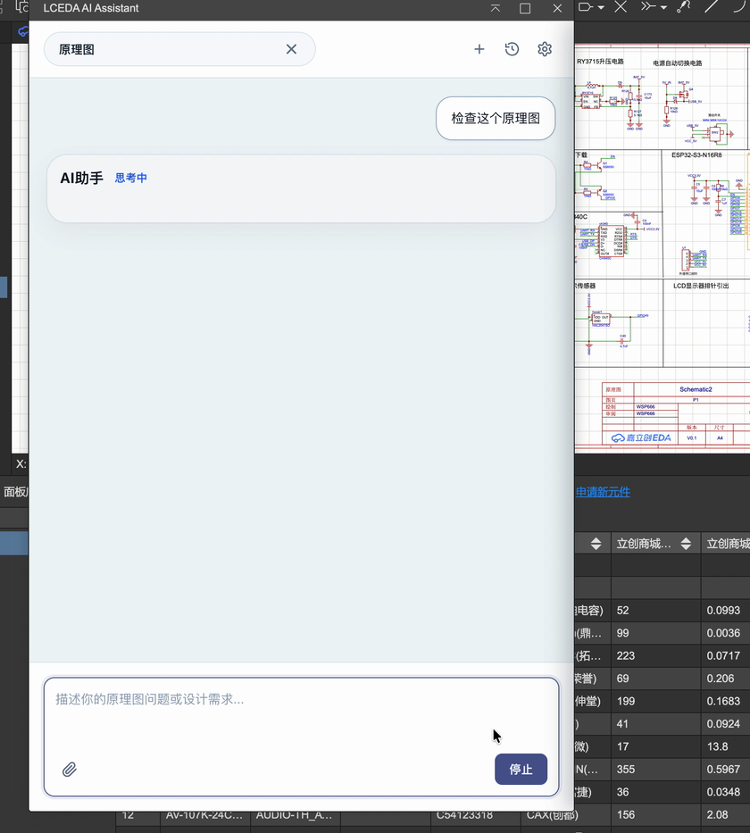
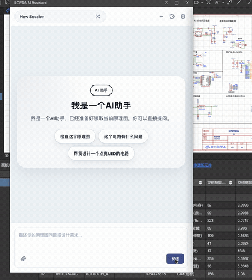

# 嘉立创 EDA AI 分析助手

嘉立创 EDA AI 分析助手用于在嘉立创 EDA 标准版与专业版中辅助完成原理图分析、规则检查和电路草案生成。插件会读取当前原理图上下文，结合 AI 能力给出设计建议、问题定位和可预览的草案方案。

## 功能演示

## 主要功能

- 原理图上下文分析：读取当前工程、页面、选中器件、网络和基础统计信息。
- AI 助手对话：在插件面板中输入设计需求或检查问题，获得面向当前原理图的回复。
- 规则检查：对原理图和生成草案执行基础检查，并给出问题摘要。
- 问题定位：对可定位的问题提供定位入口，辅助在原理图中快速查看相关对象。
- 草案生成：根据用户描述生成电路草案，支持预览后再应用到当前设计。
- 器件确认：草案中存在待确认器件时，可搜索候选器件并批量使用首选候选。
- 应用与回滚：确认草案后可应用到当前原理图，并支持对本次应用结果进行回滚验证。
- 登录与后端联动：支持连接配套服务端，调用知识检索和大模型生成能力。

## 使用方法

1. 在嘉立创 EDA 中安装插件包。
2. 打开一个原理图工程，并进入需要分析或生成草案的原理图页面。
3. 从原理图顶部菜单选择 `AI分析助手`，点击 `打开` 启动插件面板。
4. 在输入框中描述你的需求，例如“帮我检查当前原理图是否有明显问题”或“帮我设计一个点亮 LED 的电路”。
5. 查看 AI 返回的分析结果、规则检查结果或草案内容。
6. 如果草案中存在待确认器件，点击 `选择器件`，搜索候选并确认器件后再应用草案。
7. 点击 `应用草案` 将确认后的草案写入当前原理图；如需撤销本次应用，可使用 `回滚应用`。

## 使用建议

- 建议先在测试工程中验证草案生成和应用效果，再用于正式工程。
- 使用草案应用前，请确认器件型号、封装、电气连接和设计约束符合实际项目要求。
- 如果插件提示宿主能力缺失，请升级嘉立创 EDA 客户端或在支持的原理图环境中重试。
- 如需使用联网 AI 能力，请确保配套服务端地址、登录状态和网络连接正常。

## 当前版本

- 版本：0.1.6
- 入口：原理图顶部菜单 `AI分析助手` -> `打开`
- 适用范围：嘉立创 EDA 标准版与专业版原理图场景

---

# 插件端开发说明

## 作用
- 承载嘉立创 EDA 标准版与专业版插件代码。

## 当前状态
- 已初始化基础目录结构。
- 已具备最小 PoC 运行链路，可验证 mock 原理图上下文、最小 ReAct 与登录轮询流程。
- 后续按 PoC 验证与 MVP 实施顺序逐步填充。

## 首批重点目录
- `src/editor/`
- `src/rules/`
- `src/services/`
- `src/agent/`
- `src/ui/`

## 当前可运行命令
- 安装依赖：
  - `npm install`
- 官方模板风格构建：
  - `npm run build`
- 运行插件侧 PoC：
  - `BASE_URL=http://127.0.0.1:18082 npm run poc:plugin`
- 运行“已注入宿主桥接”的插件侧 PoC：
  - `POC_USE_FAKE_HOST=1 BASE_URL=http://127.0.0.1:18082 npm run poc:plugin`
- 运行浏览器登录 PoC：
  - `npm run poc:browser-login`
- 运行微信登录 PoC：
  - `BASE_URL=http://127.0.0.1:18088 npm run poc:wechat-login`
- 运行草案生成 PoC：
  - `npm run poc:draft`
- 运行 API 风格宿主桥接 PoC：
  - `npm run poc:api-host`
- 运行 shape 风格宿主落图 PoC（不依赖 source API）：
  - `npm run poc:shape-host`

## 当前 PoC 覆盖范围
- mock 标准版/专业版编辑器适配器
- 宿主桥接注入与真实通道优先逻辑
- 原理图上下文采集
- 最小 `ReAct + ToolRegistry`
- 最小本地规则引擎与 `rules_run_schematic_checks`
- 规则结果到 `editor_locate` 的最小问题定位闭环
- 服务端邮箱登录会话轮询
- 浏览器启动器与登录轮询控制器
- 登录态持久化存储抽象
- 自定义 LLM 配置本地持久化抽象
- 服务端 `rag_search` / `llm_generate` 最小联调链路
- 草案生成、预览与 `rules_validate_draft` 最小闭环
- `editor_preview_apply_plan` / `editor_apply_plan` 最小闭环

## 当前限制
- 尚未接入真实嘉立创标准版/专业版插件 API
- 尚未验证插件宿主内浏览器拉起
- 当前 Node PoC 使用 `MemoryKeyValueStore`，真实插件环境还需接入宿主本地存储
- 尚未实现真实 UI 面板配置页

## 嘉立创环境测试
- 先在 `plugin/` 目录执行：
  - `npm install`
  - `npm run build`
- 构建结果目录：
  - `plugin/dist/`
- 官方风格发布包目录：
  - `plugin/build/dist/`
- 当前测试包内容：
  - `plugin/build/package/extension.json`
  - `plugin/build/package/dist/index.js`
- 当前发布包内容：
  - `plugin/build/dist/lceda-ai-assistant_v0.1.0.eext`
- 当前发布包已收紧为最小运行集：
  - `extension.json`
  - `dist/index.js`
  - 当前已显式打入宿主内嵌页面目录 `iframe/`
  - 若后续存在静态资源，则显式打入 `images/`、`locales/`
- 导入嘉立创后，通过 `headerMenus.sch[].registerFn=activate` 触发入口，并尝试：
  - 自动探测标准版/专业版宿主桥接
  - 运行最小启动分析链路
  - 将调试信息输出到宿主控制台
  - 优先通过 `eda.sys_IFrame` 打开宿主内嵌助手面板
  - 若宿主不支持 `eda.sys_IFrame`，则回退到 `eda.sys_Dialog` 摘要对话框
  - 当前面板已支持：
    - `重新分析`
    - `登录`
    - 问题 `定位`
    - 草案 `生成草案`
- 插件激活后，控制台会固定输出以下前缀日志，作为真实宿主自检入口：
  - `[lceda-ai-assistant] activate`
  - `[lceda-ai-assistant] capability_report`
  - `[lceda-ai-assistant] typed_host_probe`
  - `[lceda-ai-assistant] typed_document_context`
- 建议在嘉立创宿主控制台重点查看：
  - 是否出现 `[lceda-ai-assistant] activate`
  - 是否出现 `[lceda-ai-assistant] capability_report`
  - 是否出现 `[lceda-ai-assistant] typed_host_probe`
  - 是否出现 `[lceda-ai-assistant] typed_document_context`
  - 是否出现 `host missing required capabilities`
  - 是否出现原理图统计信息（`components` / `nets` / `selection`）
- 建议最短验证步骤：
  - 在嘉立创打开一个原理图工程，并选中至少一个器件或网络
  - 从原理图顶部菜单打开 `LCEDA AI Assistant`
  - 先确认是否弹出 `LCEDA AI Assistant` 摘要对话框
  - 打开宿主开发者控制台，按 `[lceda-ai-assistant]` 过滤日志
  - 确认 `typed_host_probe.selectedPrimitiveIds` 能看到当前选中图元
  - 确认 `typed_document_context.project.projectId/pageId` 有值
  - 若日志中 `capability_missing` 非空，则优先按缺失能力排查当前宿主 API
- 阶段 1（器件确认弹窗）建议验收步骤：
  - 前置条件：
    - 使用 `npm run build` 重新打包并导入最新 `.eext`
    - 在宿主中打开可编辑原理图页，并确保插件面板可正常打开
  - 操作路径：
    - 在面板输入“帮我设计一个点亮LED的电路”并发送
    - 等待草案返回后，点击 `选择器件`
    - 在弹窗点击 `搜索全部待确认`
    - 等待候选加载完成后，点击 `全部使用首选候选`
    - 确认“待确认”计数为 `0`
    - 返回主流程点击 `应用草案`
  - 预期结果：
    - 未确认器件存在时，`apply` 必须被阻断并提示先选择器件
    - 弹窗中可看到每个待确认器件的候选列表
    - 批量操作执行中按钮会禁用，结束后恢复
    - 全部确认后弹窗自动收敛（或保持可关闭状态），并提示可应用草案
    - 应用成功后显示器件/网络数量摘要，可执行 `回滚应用`
  - 失败排查建议：
    - 若 `搜索全部待确认` 后无候选，优先检查宿主 `searchLibraryDevices` 能力
    - 若 `全部使用首选候选` 后仍有未确认项，检查该器件是否缺失 `preferred_search_query`
    - 若 `应用草案` 失败，检查宿主 `applyPlan`/typed placement 能力与控制台错误栈
- 当前 `extension.json` 已按嘉立创文档收口的关键点：
  - 使用 `entry` 而不是 `main`
  - 使用 `engines.eda`
  - `categories` 使用官方允许值
  - 通过 `headerMenus` + `registerFn` 暴露插件入口

## 嘉立创测试环境发布
- 本地导入联调用：
  - `plugin/build/dist/lceda-ai-assistant_v0.1.0.eext`
- 后台上传测试环境用：
  - `plugin/build/dist/*.eext`
- 重新打包流程：
  - 修改 `.env` 或代码后执行 `npm run build`
- 当前已按官方开始教程的关键结构收口：
  - 使用 `/src/index.ts` 作为入口源码
  - 使用 `npm run build`
  - 使用 `pro-api-sdk` 风格的 `config/esbuild.prod.ts` 与 `build/packaged.ts`
  - 已接入 `@jlceda/pro-api-types`，用于真实宿主探针类型校验
  - 宿主桥接中的“读取选区”和“打开外部窗口”已增加官方类型 API 优先路径
  - 宿主桥接中的“当前文档 / 当前原理图页信息”已增加官方类型 API 补齐路径
  - 产物输出到 `/build/dist/`
  - 增加 `.edaignore`

## 打印日志
在嘉立创f12控制台中执行:
localStorage.setItem("lceda_ai.perf_debug", "1")
window.__LCEDA_AI_PERF_DEBUG__ = true

关闭打印
localStorage.removeItem("lceda_ai.perf_debug")
window.__LCEDA_AI_PERF_DEBUG__ = false

## 技术探讨
加Q: 574781136
